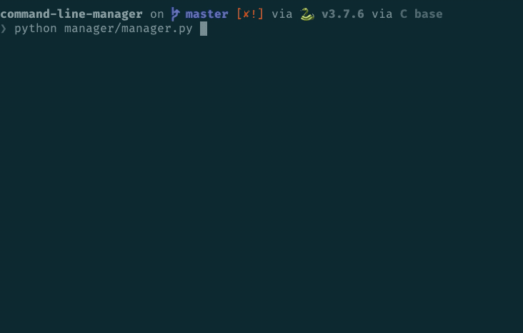

# Command Line Manager

The **Command Line Manager** is an utility to easily manage personal scripts. Through the cli, you can add, edit, remove, and explore your commands (the entry point to your scripts). This is an easy way to keep things organized and boost productivity.

## How it Works

There are two parts for the manager: metadata and content. When adding a new command, two files will be created:

1. All the command's metadata will be stored in `your_command.yml`.
2. The contents of the `your_command.sh` file will be copied inside of a shell function (by the same name as `your_command`) and called everytime you use the command from your terminal.

You will need to modify the shell file to write your own command or script, but you are encoraged to only modify the metadata file using the Command Line Manager's `add`, `edit`, and `rm` sub-commands.

After you have generated commands, you can run the `load` sub-command to generate a file called `__functions.sh__`. Source this file and that's it!

If you need to add further files, feel free to place them (or any directories) under `~/.clmanager/public`, and reference them in your scripts as needed.

## Getting Started

This will change soon, but for now you can clone the repository and run the `manager.py` file directly.

Make sure to create the following empty directories:

1. `~/.clmanager`
2. `~/.clmanager/lib`
3. `~/.clmanager/metadata`
4. `~/.clmanager/internal`
5. `~/.clmanager/public`

After you have added commands to the manager, you will need to source the generated `__functions.sh__` file.